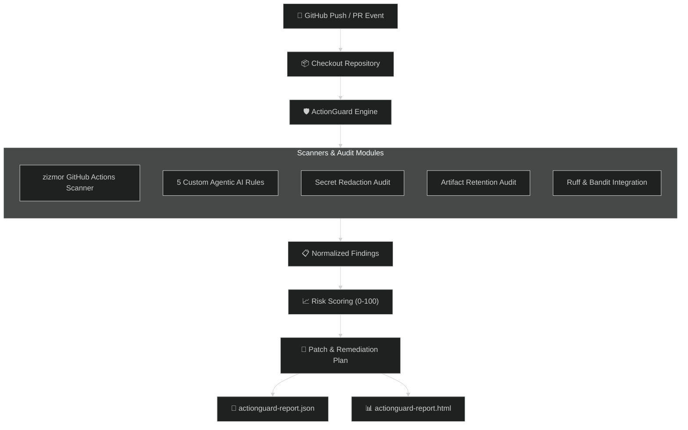
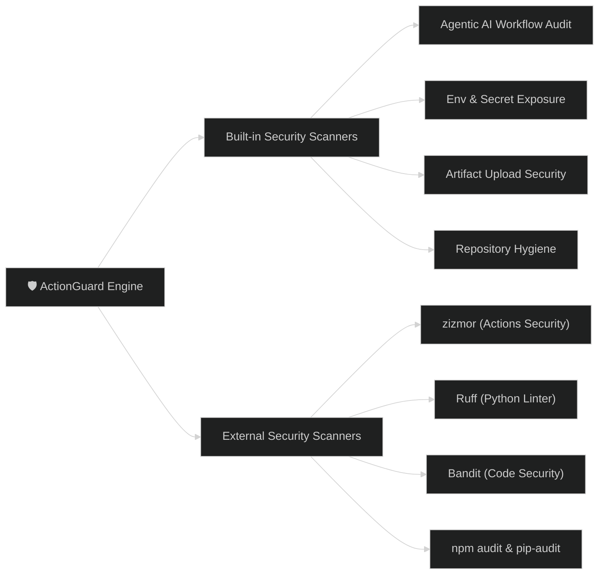

<div align="center">

# 🛡️ ActionGuard AutoAudit

<a href="https://git.io/typing-svg">
  
</a>

<p align="center">
  <b>Detection &nbsp;➔&nbsp; Evidence &nbsp;➔&nbsp; Severity &nbsp;➔&nbsp; Suggested Fix &nbsp;➔&nbsp; Patch Preview &nbsp;➔&nbsp; HTML Report</b>
</p>

[](https://github.com/Tayab-Ahamed/Actionguard-CI/actions/workflows/actionguard-autoaudit.yml)
[](https://opensource.org/licenses/MIT)
[](https://www.python.org/)
[](https://github.com/astral-sh/ruff)
[](https://github.com/PyCQA/bandit)

---

</div>

ActionGuard extends [zizmor](https://github.com/zizmorcore/zizmor) with agentic workflow-injection detection, committed secret redaction, artifact upload security checks, multi-scanner integrations, normalized risk scoring, and interactive HTML/JSON reporting.

---

## ⚡ Quick Start

```bash
# Set up virtual environment and install ActionGuard
python -m venv .venv && source .venv/bin/activate
pip install -e '.[dev]' zizmor

# Run security audit on current repository
actionguard audit . --html reports/actionguard-report.html --json reports/actionguard-report.json
```

> **Note**: Missing optional scanners fail gracefully without breaking the audit run.

---

## 🤖 5 Agentic AI Workflow Security Rules

| Rule ID | Name | Threat Category | Description |
| :--- | :--- | :--- | :--- |
| `AG-AI-001` | **Issue Comment Trigger** | Untrusted Trigger | Detects `issue_comment` triggers vulnerable to prompt injection |
| `AG-AI-002` | **Write-All Permissions** | Excessive Privilege | Flags `permissions: write-all` on AI workflow runners |
| `AG-AI-003` | **Unescaped Input in Shell** | Shell Injection | Identifies unescaped `${{ github.event.comment.body }}` in `run:` |
| `AG-AI-004` | **Dynamic Script Execution** | Code Execution | Detects AI generating and executing temporary shell scripts |
| `AG-AI-005` | **Secret Injected to AI** | Credential Exposure | Flags secrets passed to untrusted AI agent execution context |

---

## 📊 Pipeline Architecture & Workflow



---

## 🛠️ Security Rules & Multi-Scanner Integration



---

<details>
<summary><b>💻 Available CLI Commands</b> (Click to expand)</summary>

```bash
# Complete audit (HTML + JSON report)
actionguard audit .

# Alias for audit
actionguard scan .

# Re-render HTML from an existing JSON report
actionguard report --json actionguard-report.json --html actionguard-report.html

# Run via python module
python -m actionguard.cli audit . --html report.html --json report.json
```

Add `--email` to send HTML reports via SMTP when `MAIL_USERNAME`, `MAIL_PASSWORD`, and `REPORT_TO_EMAIL` environment variables are configured.

</details>

<details>
<summary><b>🔒 Safety & Redaction Model</b> (Click to expand)</summary>

- **Secret Redaction**: Credentials are automatically truncated to first six characters followed by `...redacted`.
- **Scan Safeguards**: Skips binary files, files > 1 MB, and build output directories (`node_modules`, `.venv`, `dist`).
- **Non-destructive**: ActionGuard never deletes `.env` files, rotates keys, or alters repository permissions automatically.

</details>

<details>
<summary><b>🧪 Demo & Test Fixtures</b> (Click to expand)</summary>

```bash
# Run audit on demo vulnerable repository
actionguard audit examples/demo-vulnerable-repo \
  --html reports/demo-report.html --json reports/demo-report.json

# Run unit test suite
pytest -q
```

</details>

---

## 🤝 Contributing

Contributions are very welcome! Whether it's adding new security rules, improving report visualizations, or integrating additional static analysis scanners:

1. Check out our [Contributing Guide](CONTRIBUTING.md) for local setup and testing instructions.
2. Open an issue or pull request using our templates.

---

## 📜 Upstream Attribution & License

ActionGuard uses [zizmor](https://github.com/zizmorcore/zizmor) as its core GitHub Actions scanner integration under its upstream license. See [NOTICE.md](NOTICE.md).

Distributed under the [MIT License](LICENSE).
